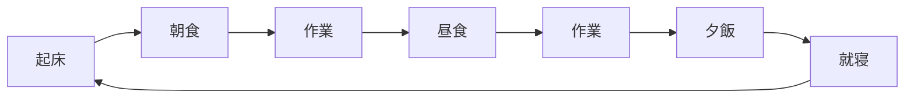
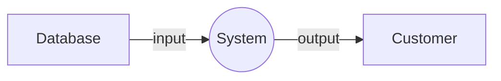
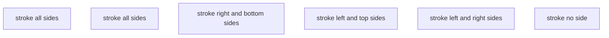
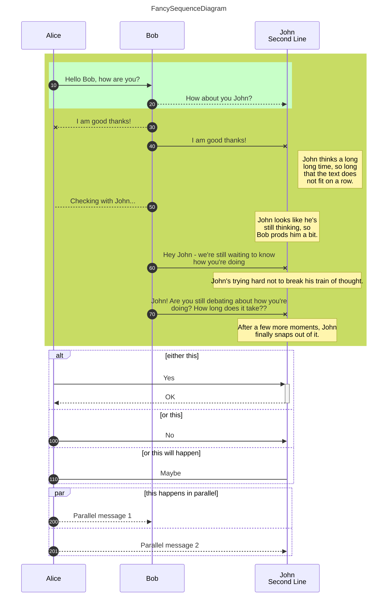
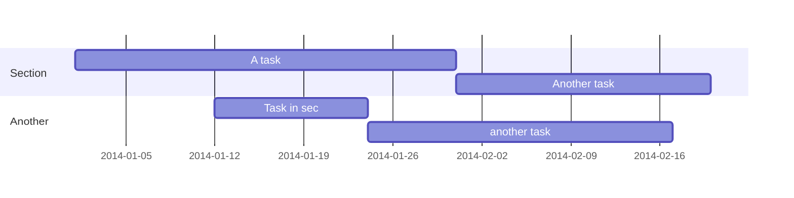
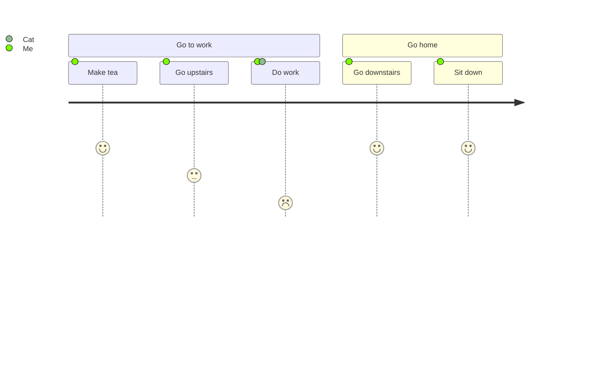

Markdownサンプル
================

コード
------

```html:index.html
<!DOCTYPE html>
<html lang="ja">
  <head>
    <meta charset="utf-8">
    <meta name="viewport" content="width=device-width">
    <meta name="robots" content="none">
    <title>MARKED</title>
    <meta http-equiv="Content-Style-Type" content="text/css" />
    <meta http-equiv="Content-Script-Type" content="text/javascript" />
    <!-- CSS -->
    <link rel="stylesheet" href="https://cdn.jsdelivr.net/gh/highlightjs/cdn-release@11.5.1/build/styles/github.min.css">
    <!-- JS -->
    <script src="https://cdn.jsdelivr.net/gh/highlightjs/cdn-release@11.5.1/build/highlight.min.js"></script>
    <script src="https://cdn.jsdelivr.net/npm/jquery@3.6.0/dist/jquery.min.js"></script>
    <script src="https://cdn.jsdelivr.net/npm/mermaid@9.1.1/dist/mermaid.min.js"></script>
    <script src="https://cdn.jsdelivr.net/npm/marked@4.0.16/marked.min.js"></script>
    <script>mermaid.initialize({startOnLoad:false});</script>
  </head>

  <body id="content">
    <script>
      //Markedのレンダリング設定
      //参考  https://mermaid-js.github.io/mermaid/#/usage?id=example-of-a-marked-renderer
      var renderer = new marked.Renderer();
      renderer.code = function (code, language) {
        if (language == 'mermaid') {
          //mermaid.js処理対象設定
          return '<div class="mermaid">' + code + '\n</div>';
        } else {
          //hilight.js処理
          return '<pre><code>\n' + hljs.highlightAuto(code).value + '\n</code></pre>';
        }
      }
      marked.use({ renderer });

      //Markdownファイル読み込み
      $(document).ready(function(){
        if (location.href.split("#").length > 1) {
          var urlParam = location.href.split("#")[1];
          $.get( urlParam, function( data ) {
            //marked.js処理
            $('#content').html(marked.parse(data));
            //mermaid.js処理
            mermaid.init();
          });
        } else {
          $('#content').html('please url#any.md');
        }
      });
    </script>
  </body>
</html>
```

グラフ
------

### flowchart#1



### flowchart#2



### flowchart#3



### sequenceDiagram



### gantt



### journey


